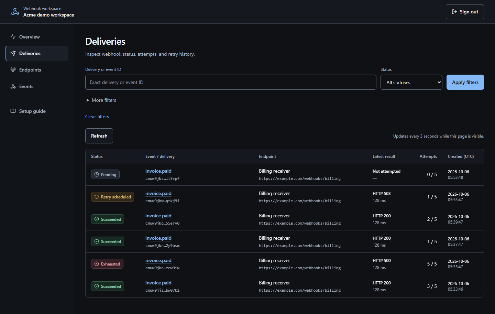
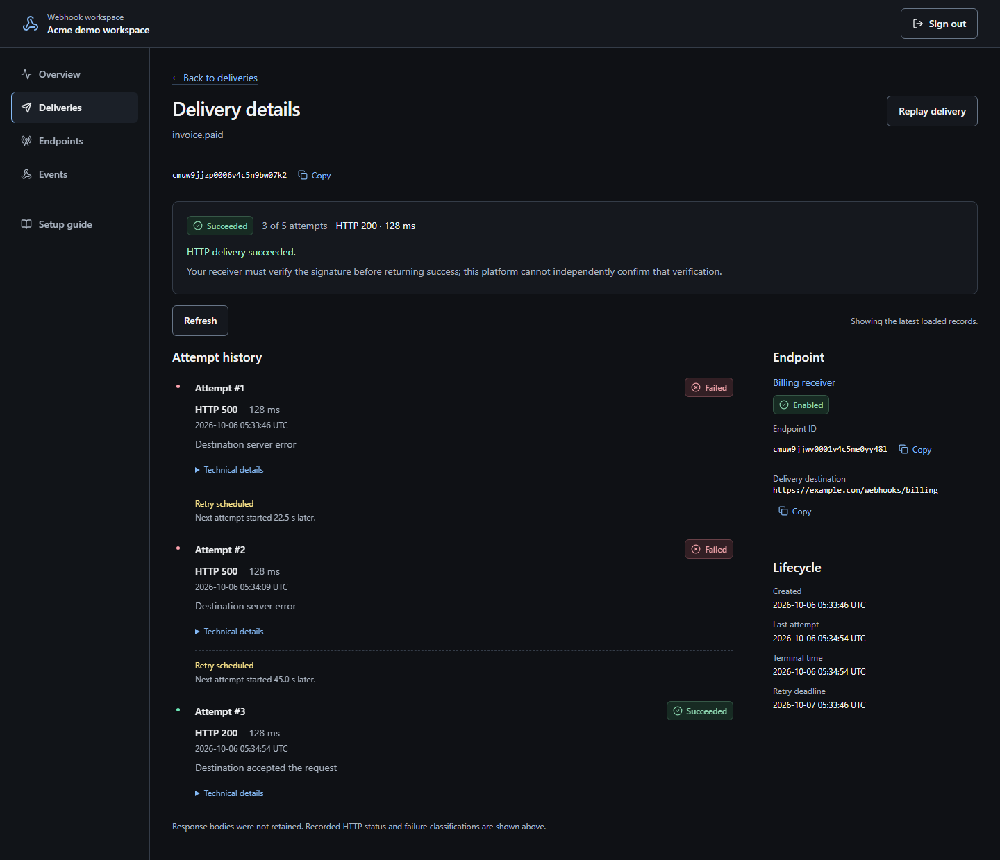
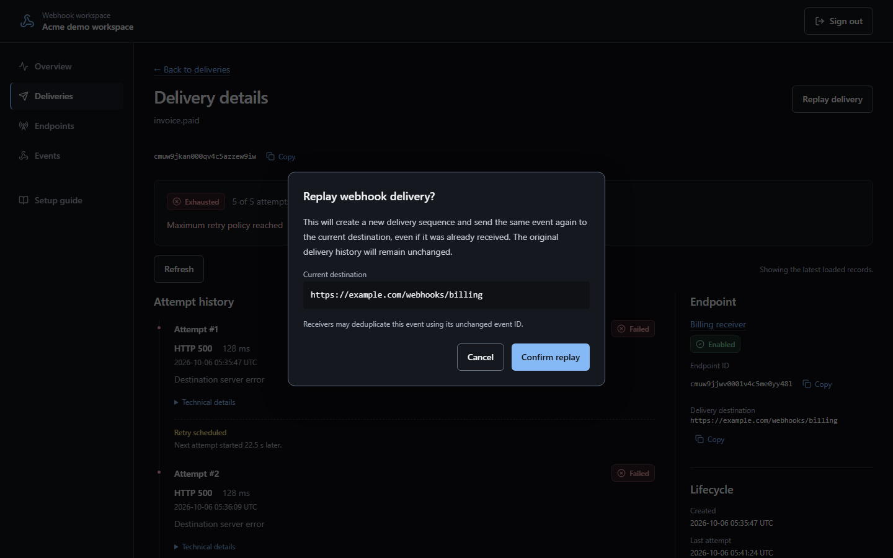
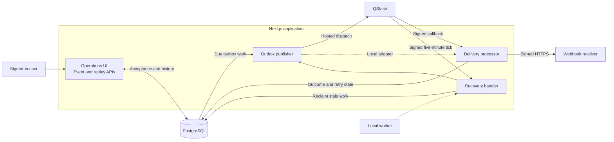

# Reliable Webhook Platform

A webhook delivery platform that accepts events durably, sends signed HTTP requests, and gives operators a path from failed delivery to recovery. Queue outages, retries, and worker crashes become explicit persisted states with inspectable history.

- **Durable acceptance:** events, deliveries, and outbox work commit before the API returns `202`.
- **Recoverable processing:** leased claims, stale-worker fencing, bounded retries, and scheduled recovery.
- **Secure delivery:** HMAC signatures, encrypted secrets, tenant-scoped access, and connection-time destination checks.
- **Operational visibility:** searchable history, attempt timelines, and replay without overwriting previous attempts.

[Live application](https://webhooks.mubashirhussain.dev) · [Architecture](docs/architecture.md) · [API contract](docs/openapi.json) · [Demo walkthrough](docs/demo.md)

**Status:** v1 is implemented and locally verified. The hosted application is available; full hosted OAuth, QStash, and recovery acceptance remains [pending in the release evidence](docs/reviews/m4-v1-hardening.md#hosted-acceptance--final-sign-off--2026-10-04).

## See it in operation

Sign in with GitHub, create a workspace, register a public HTTPS receiver, and submit an event. Use synthetic data only; history is not automatically deleted. Default daily acceptance limits are 25 deliveries per workspace and 100 globally, including replays.



<details>
<summary>Inspect retries and replay</summary>

An attempt timeline explains how a delivery reached its current state:



Replay confirms the current destination and creates a separate delivery:



</details>

Screenshots show the actual UI reading persisted synthetic local records. Outcomes and retry time are controlled for demonstration; these are not hosted-delivery measurements.

## Architecture and delivery lifecycle

One Next.js modular monolith owns the UI, APIs, services, and worker callbacks. PostgreSQL is authoritative; QStash provides hosted scheduling and invocation.



1. **Accept:** validate the session, workspace, endpoint, and quota. Commit the event, delivery, outbox, audit, and counters together; then return `202`.
2. **Dispatch:** attempt an outbox drain after the response. Publication failure leaves durable work for recovery. Local dispatch invokes the same processor directly.
3. **Deliver:** claim a generation under a lease, persist the attempt, and send stored bytes using the pinned destination and secret version.
4. **Complete or retry:** commit the outcome and delivery state with any next-generation outbox record. Recovery handles expired leases, missing work, and overdue callbacks.

Application policy owns retry timing; QStash provider retries are disabled. [Delivery and recovery details](docs/m2-delivery.md).

## Guarantees and idempotency

A `202` means work is committed, not that the receiver processed it. Delivery is **at least once**: a crash after remote receipt but before saving success can cause another request. Recovery records unresolved attempts as `UNCERTAIN`; claim tokens fence stale workers.

Automatic processing permits **five attempts within 24 hours**, with a five-second HTTP deadline, equal-jitter exponential backoff, and bounded `Retry-After` for 429/503 responses. Permanent failures or exhausted retry budgets end the delivery. Recovery requires the database, application, and scheduler to become available; eventual success and exactly-once processing are not promised.

| Boundary            | Behavior                                                                                                                                                     |
| ------------------- | ------------------------------------------------------------------------------------------------------------------------------------------------------------ |
| Producer submission | A workspace-scoped event ID returns the existing delivery for equivalent content; conflicting content returns `409`.                                         |
| Queue callback      | Generation and persisted-state checks ignore duplicate or obsolete work.                                                                                     |
| Replay request      | A workspace-scoped `Idempotency-Key` returns the same replay for 24 hours. New replays preserve original event bytes and use current endpoint configuration. |
| Receiver            | Atomically deduplicate `webhook-id` with the business update. Replay retains that ID, so previously processed events may be ignored.                         |

Replay requires a terminal delivery and enabled endpoint. Confirmation rechecks the endpoint revision before committing. [Replay contract](docs/m3-operations.md#replay).

## Security boundaries

- GitHub OAuth and Better Auth database sessions supply workspace identity. Queries are tenant-scoped; foreign records return `404`. Session mutations require the configured Origin.
- HMAC-SHA256 signs `eventId.timestamp.rawBody`. The [consumer example](docs/signing.md#consumer-implementation) checks exact bytes, timestamp freshness, and signatures using constant-time comparison.
- Signing secrets are shown once on creation/rotation and encrypted with versioned AES-256-GCM, bound to workspace, endpoint, and secret version.
- Destinations require public HTTPS on port 443. DNS addresses are checked at registration and connection; redirects are not followed. QStash signatures bind callbacks to their exact body and expected URL.

Response bodies are not retained. Bounded parsing, PostgreSQL-backed request limits, quotas, and allowlisted diagnostics limit abuse and accidental disclosure.

## Operations and verification

Structured lifecycle logs carry correlation and resource IDs without payloads or credentials. Durable hourly counters and timing aggregates support an operator report. Liveness is dependency-free; readiness validates configuration and database connectivity, without claiming provider health. Production builds check configuration, database identity, and migration state.

| Recorded evidence                                                       | Result                                                                                                           |
| ----------------------------------------------------------------------- | ---------------------------------------------------------------------------------------------------------------- |
| [Local verification, 2026-10-05](docs/reviews/ui-refresh.md#validation) | 81 unit, 44 integration, and 27 browser tests passed; build, types, lint, formatting, and OpenAPI checks passed. |
| [Load run, 2026-09-26](docs/reviews/m4-load-evidence.json)              | 1,000 events, 3 endpoints, concurrency 8; 1,000 successes in 1,100 attempts, including 100 initial failures.     |
| [Measured latency](docs/load-testing.md#results)                        | Service ingestion p95: 494.88 ms; history-page p95: 22.01 ms.                                                    |

Tests exercise rollback, concurrency, publication failures, worker exits, fencing, tenant isolation, signing, replay, and history preservation. The load run used signed loopback HTTP with an injected transport and accelerated retries; it excluded ingress HTTP/authentication and live QStash/public TLS. These are local measurements, not production capacity claims.

[Current CI](https://github.com/mubidotjs/reliable-webhook-platform/actions/workflows/ci.yml) · [Load methodology](docs/load-testing.md) · [Operations and release checks](docs/m4-operations.md)

## Stack and local setup

| Area                     | Technologies                                                |
| ------------------------ | ----------------------------------------------------------- |
| Application              | TypeScript, Next.js 16, React 19, Tailwind CSS              |
| Persistence and identity | PostgreSQL 17, Prisma 7, Better Auth, GitHub OAuth          |
| Background delivery      | PostgreSQL outbox, Upstash QStash, local worker             |
| Contracts and testing    | Zod, OpenAPI 3.1, Vitest, Playwright, Fastify test receiver |
| Deployment               | Vercel, PostgreSQL/Neon, Docker Compose locally             |

Requires Node.js 24, pnpm 11.19.0, Docker Compose v2, and a GitHub OAuth app.

```sh
pnpm install --frozen-lockfile
```

Copy `.env.example` to `.env`. Set database URLs, GitHub credentials, a random auth secret, and a 32-byte base64url encryption key. Register `http://localhost:3000/api/auth/callback/github` as the OAuth callback. [Export the environment in each shell](docs/m4-operations.md#environment-loading), then:

```sh
docker compose up -d postgres
pnpm db:generate
pnpm db:deploy
pnpm dev
```

Run `pnpm --filter @rwp/web worker` in another configured shell. The app uses `http://localhost:3000`; the development receiver uses `http://localhost:4000`. PostgreSQL defaults to port `54329`.

Endpoint registration still requires public HTTPS; the local HTTP receiver serves the [isolated demo harness](docs/demo.md). See the [workspace guide](docs/webhook-workspace.md) for your first delivery and the [deployment runbook](docs/m4-operations.md#vercel-production-deployment) for hosting.

## Design trade-offs and next steps

- **Modular monolith:** keeps acceptance transactional and deployment small; independent service scaling awaits measured demand.
- **Outbox and application retries:** make failures recoverable and auditable, with extra persistence and recovery work.
- **PostgreSQL limits and metrics:** avoid additional infrastructure; global acceptance locks and shared aggregates constrain scaling.
- **Bounded delivery and retained history:** control retry cost and preserve evidence; prolonged outages can exhaust work, and retention needs explicit management.

V1 deliberately uses one owner/workspace per account and conservative demo quotas. Future work includes producer API keys, automated history retention, richer analytics/export, and measured scaling beyond those quotas. Hosted acceptance remains a separate verification gate.

Further reading: [Architecture](docs/architecture.md) · [Design decisions](docs/adr) · [Signing](docs/signing.md) · [Operations UI and replay](docs/m3-operations.md) · [Metrics, limits, and deployment](docs/m4-operations.md)

[MIT license](LICENSE)
