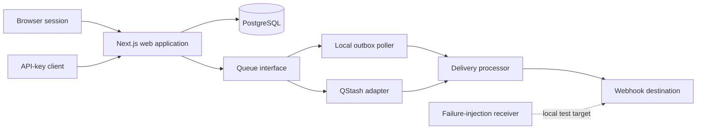
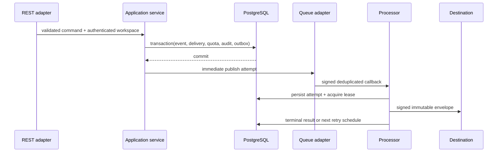

# Architecture

## System shape

Reliable Webhook Platform is a modular monolith. One deployable web application owns browser pages, REST adapters, application services, persistence adapters, and authenticated worker callbacks. A separate local receiver exists only to exercise delivery behavior.

M0 implements the solid foundation nodes and their interfaces. M1 adds secure endpoint and key management. M2 completes the delivery path and queue adapters. M3 adds operational workflows, and M4 adds retention, load evidence, and release hardening.

## Module boundaries

`apps/web` is organized around capabilities rather than framework layers: identity, workspaces, API keys, endpoints, events, deliveries, audit, and operations. Route handlers and server actions authenticate, validate, and translate transport inputs before calling application services. They do not own business rules.

`packages/domain` contains deterministic policy with no framework or database dependency. `packages/contracts` is the source for Zod request/response schemas, RFC 7807 problems, API types, and OpenAPI generation. `packages/config` validates environment input at process boundaries. Prisma remains an adapter inside `apps/web`.

## Authentication and tenancy

Better Auth owns GitHub OAuth and database sessions. Every mutation rechecks the session or API key at the execution boundary. A workspace is derived only from the authenticated credential; workspace identifiers supplied by clients are never trusted as authorization. `Workspace.ownerId` is unique in v1, intentionally enforcing one workspace per account.

## Persistence baseline

The foundation migration creates Better Auth records plus all planned v1 aggregates so later milestones can add behavior without destructive table churn. Foreign keys state deletion behavior explicitly. Compound indexes support cursor reads and worker claims. Partial unique indexes cover invariants that Prisma cannot express: a single primary delivery per event and one global quota bucket per subject and UTC bucket.

## Reliability flow (M2 target)

The application owns retry timing and state. Queue-provider retries are disabled. Processing is at least once: a crash after the HTTP send but before result persistence can produce another attempt.

## Runtime configuration

Local development uses PostgreSQL and the outbox poller. Hosted configuration is designed for Vercel, Neon, and QStash, but M0 provisions none of them. Sensitive values remain server-only environment variables. Production must provide explicit credentials and must never use development fallbacks.
