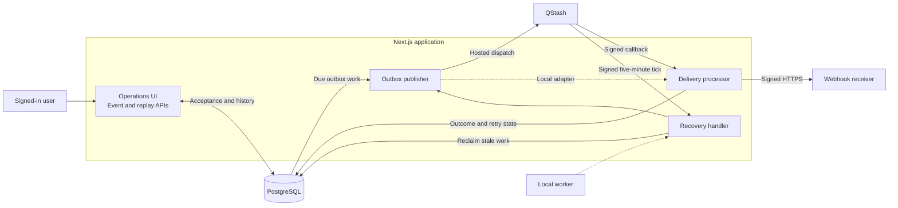
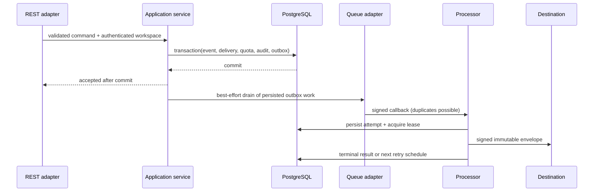

# Architecture

## System shape

Reliable Webhook Platform is a modular monolith. One deployable web application owns browser pages, REST adapters, application services, persistence adapters, and authenticated worker callbacks. A separate local receiver exists only to exercise delivery behavior.

```mermaid
flowchart LR
  User[Signed-in user] --> UI
  subgraph App[Next.js application]
    UI["Operations UI<br/>Event and replay APIs"]
    Publisher[Outbox publisher]
    Processor[Delivery processor]
    Recovery[Recovery handler]
  end
  UI <-->|Acceptance and history| DB[(PostgreSQL)]
  DB -->|Due outbox work| Publisher
  Publisher -->|Hosted dispatch| Q[QStash]
  Q -->|Signed callback| Processor
  Q -->|Signed five-minute tick| Recovery
  Recovery -->|Reclaim stale work| DB
  Recovery --> Publisher
  Local[Local worker] -.-> Recovery
  Publisher -. Local adapter .-> Processor
  Processor -->|Signed HTTPS| Destination[Webhook receiver]
  Processor -->|Outcome and retry state| DB
```

The implemented v1 includes endpoint management, durable delivery, operational history/replay, and observability. Automatic delivery-history retention and producer API-key authentication remain future work. Local verification and hosted acceptance are tracked separately in the [release evidence](reviews/m4-v1-hardening.md).

## Module boundaries

`apps/web` organizes application modules around workspaces, endpoints, events, deliveries, and dashboard queries. Shared libraries provide authentication and request boundaries; audit records and operational metrics are written by application services. Route handlers and server actions authenticate, validate, and translate transport inputs before calling those services.

`packages/domain` contains deterministic policy with no framework or database dependency. `packages/contracts` is the source for Zod request/response schemas, RFC 7807 problems, API types, and OpenAPI generation. `packages/config` validates environment input at process boundaries. Prisma remains an adapter inside `apps/web`.

## Authentication and tenancy

Better Auth owns GitHub OAuth and database sessions. Workspace mutations recheck the session and trusted Origin at the execution boundary. A workspace is derived only from the authenticated owner; workspace identifiers supplied by clients are never trusted as authorization. `Workspace.ownerId` is unique in v1, intentionally enforcing one workspace per account. Internal worker callbacks instead require a valid QStash signature for the exact body and expected URL. Producer API-key authentication is not implemented.

## Persistence baseline

The foundation migration creates Better Auth records plus all planned v1 aggregates so later milestones can add behavior without destructive table churn. Foreign keys state deletion behavior explicitly. Compound indexes support cursor reads and worker claims. Partial unique indexes cover invariants that Prisma cannot express: a single primary delivery per event and one global quota bucket per subject and UTC bucket.

## Reliability flow (M2)

```mermaid
sequenceDiagram
  participant A as REST adapter
  participant S as Application service
  participant D as PostgreSQL
  participant Q as Queue adapter
  participant W as Processor
  participant T as Destination
  A->>S: validated command + authenticated workspace
  S->>D: transaction(event, delivery, quota, audit, outbox)
  D-->>S: commit
  S-->>A: accepted after commit
  S->>Q: best-effort drain of persisted outbox work
  Q->>W: signed callback (duplicates possible)
  W->>D: persist attempt + acquire lease
  W->>T: signed immutable envelope
  W->>D: terminal result or next retry schedule
```

The application owns retry timing and state. Queue-provider retries are disabled. Processing is at least once: a crash after the HTTP send but before result persistence can produce another attempt.

## Runtime configuration

Local development uses PostgreSQL and the outbox poller. Hosted configuration targets Vercel, PostgreSQL/Neon, and QStash. Sensitive values remain server-only environment variables. Production must provide explicit credentials and must never use development fallbacks. See the [operations runbook](m4-operations.md#vercel-production-deployment) for deployment checks and the signed recovery schedule.

## Retry, replay and trade-offs

Failure → immutable attempt outcome → RETRY_SCHEDULED plus next-generation outbox in one transaction → delayed queue invocation → next attempt. Expired processing leases produce UNCERTAIN outcomes, and tokens fence stale completion. Remote receipt can still have happened, so consumers must deduplicate.

Replay validates tenant, Origin, idempotency key and endpoint revision, then creates new delivery/outbox records from original event bytes and current endpoint snapshots.

- **Transactional outbox:** acceptance survives queue outages, at the cost of extra persistence and recovery work.
- **At least once:** remote side effects and local commits cannot share a transaction; uncertain outcomes make ambiguity explicit.
- **QStash:** avoids a dedicated hosted worker but requires public callbacks and a functioning recovery schedule.
- **Bounded retries:** control resources; prolonged outages may explicitly exhaust accepted work.
- **Immutable attempts:** preserve audit evidence; replay cannot overwrite the past.
- **Cursor pagination:** creation time plus ID gives deterministic bounded tenant reads; details have at most five attempts.
- **PostgreSQL metrics/limits:** reuse infrastructure without Redis or a metrics cluster. Fixed metric dimensions avoid ID cardinality; global acceptance locking and aggregate contention limit throughput.
- **No response bodies:** reduces leakage and untrusted storage, while sacrificing remote debug content.
